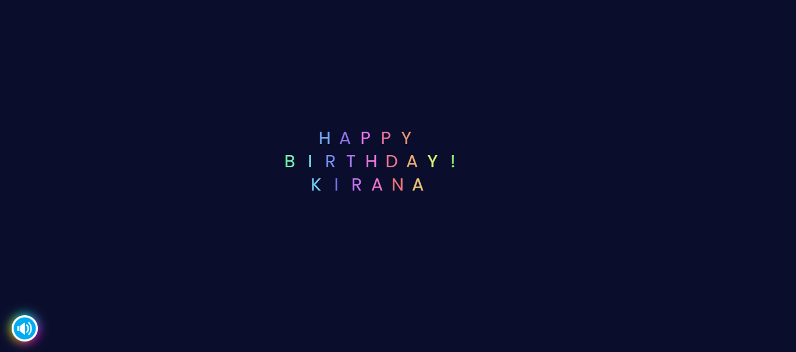
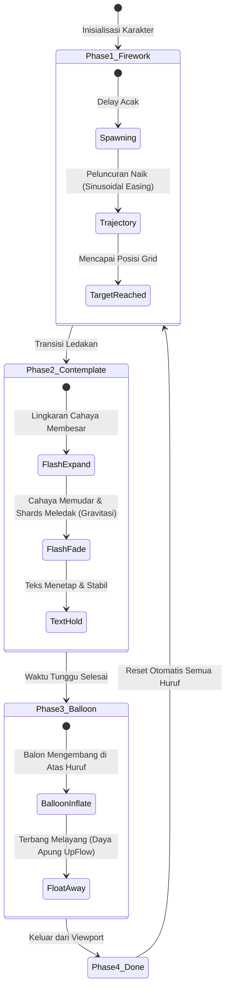

<div align="center">

# 🎆 Happy Birthday Interactive Canvas Animation 🎈



**Animasi Kanvas Interaktif & Audio Player Perayaan Ulang Tahun Modern Berbasis Web**

[](https://developer.mozilla.org/en-US/docs/Web/HTML)
[](https://developer.mozilla.org/en-US/docs/Web/CSS)
[](https://developer.mozilla.org/en-US/docs/Web/JavaScript)
[](https://developer.mozilla.org/en-US/docs/Web/API/Canvas_API)
[](#-kompatibilitas--responsivitas)
[](#-teknologi-yang-digunakan)

---

</div>

## 📖 Ringkasan Proyek

**Happy Birthday Animation** adalah aplikasi web interaktif *state-of-the-art* yang menggabungkan grafis **HTML5 Canvas 2D**, simulasi fisika partikel (*particle physics*), kurva matematika Bezier, serta sinkronisasi audio interaktif. 

Aplikasi ini menghadirkan pertunjukan ucapan selamat ulang tahun yang dinamis dan berulang (*infinite loop*), di mana setiap huruf ucapan diluncurkan sebagai kembang api, meledak dengan kilatan cahaya dramatis, membentuk tipografi bercahaya warna-warni, bertransformasi menjadi balon udara, lalu terbang melayang ke angkasa.

```
Peluncuran Kembang Api ──► Ledakan & Kilatan ──► Tipografi Bercahaya ──► Balon Melayang ──► Loop Otomatis
```

---

## ✨ Fitur-Fitur Utama

<table>
  <tr>
    <td width="50%">
      <h3>🎆 Simulasi Partikel Kembang Api & Gravitasi</h3>
      <ul>
        <li><strong>Lintasan Ekor Dinamis:</strong> Jejak ekor partikel bergradasi transparansi berbasis <em>easing sinusoidal</em>.</li>
        <li><strong>Ledakan Radial & Serpihan (Shards):</strong> Pecahan percikan terdistribusi secara trigonometris (<code>sin</code> & <code>cos</code>) dengan gaya gravitasi realistis.</li>
        <li><strong>Kilatan Cahaya (Flash Circle):</strong> Efek transisi ekspansi dan pemudaran lingkaran cahaya sebelum teks muncul.</li>
      </ul>
    </td>
    <td width="50%">
      <h3>🎈 Fisika Balon & Kurva Bezier</h3>
      <ul>
        <li><strong>Geometri Balon Realistis:</strong> Bentuk balon digambar menggunakan kurva Bezier ganda (<em>dual cubic Bezier curves</em>).</li>
        <li><strong>Fase Mengembang (Inflation):</strong> Animasi balon yang membesar secara proporsional di atas karakter teks.</li>
        <li><strong>Daya Apung Aerodinamis (UpFlow):</strong> Vektor kecepatan apung ke atas yang membawa teks melayang keluar layar.</li>
      </ul>
    </td>
  </tr>
  <tr>
    <td width="50%">
      <h3>🎵 Kontroler Audio Cerdas</h3>
      <ul>
        <li><strong>Kepatuhan Autoplay Policy:</strong> Audio otomatis menyala pada interaksi sentuhan atau klik pertama pengguna.</li>
        <li><strong>Floating Action Button (FAB):</strong> Tombol kontrol mengambang dengan efek aura <em>conic-gradient glow</em> 360°.</li>
        <li><strong>Toggle Kontrol Halus:</strong> Transisi buka/tutup kontrol media HTML5 dengan proteksi <em>debouncing</em>.</li>
      </ul>
    </td>
    <td width="50%">
      <h3>🌈 Spektrum Warna & Tipografi Modern</h3>
      <ul>
        <li><strong>Dynamic HSL Rainbow Spectrum:</strong> Kalkulasi rona warna (<em>hue</em>) otomatis merata di seluruh bentang karakter.</li>
        <li><strong>Font Google Poppins:</strong> Tipografi bersih dengan variasi ketebalan (400 & 800) yang dirender tajam pada kanvas.</li>
        <li><strong>Zero Dependencies:</strong> Murni Vanilla JavaScript, HTML5, dan CSS3 tanpa pustaka pihak ketiga.</li>
      </ul>
    </td>
  </tr>
</table>

---

## 🔬 Siklus Animasi & Arsitektur Fisika

Animasi dibangun di atas paradigma *State Machine* per karakter (`Letter`), yang bergerak melalui 4 fase siklus hidup secara mulus:



### Rincian Matematika & Fisika:
1. **Trajektori Kembang Api:**
   $$\text{Proportion} = \frac{\text{tick}}{\text{reachTime}}, \quad y = y_{\text{start}} + \sin\left(\text{Proportion} \times \frac{\pi}{2}\right) \cdot \Delta y$$
2. **Percepatan Gravitasi Serpihan:**
   $$v_y(t+1) = v_y(t) + g \quad (g = 0.1)$$
3. **Spektrum Rona Warna (Hue Dynamic):**
   $$\text{Hue} = \left(\frac{x_{\text{char}}}{\text{Total Text Width}}\right) \times 360^\circ$$
4. **Bentuk Balon (Bezier Curves):**
   Dirender menggunakan kombinasi titik kontrol `bezierCurveTo` untuk membentuk siluet balon bulat tetes air yang aerodinamis.

---

## 📂 Struktur Proyek

Struktur berkas dirancang dengan pola modular, bersih, dan mudah dipahami:

```plaintext
happy-birthday-animation/
│
├── assets/
│   ├── audio/
│   │   └── birthday-song.mp3       # Lagu latar perayaan ulang tahun (loop)
│   │
│   ├── css/
│   │   └── style.css               # Reset viewport, aura glow tombol & styling audio
│   │
│   ├── images/
│   │   ├── favicon.ico             # Ikon tab browser (favicon)
│   │   ├── preview.png             # Gambar pratinjau antarmuka animasi
│   │   └── sound-icon.png          # Asset ikon tombol musik mengambang
│   │
│   └── js/
│       └── main.js                 # Engine kanvas 2D, sistem partikel & event handlers
│
├── index.html                      # Titik masuk utama aplikasi (Semantic HTML5)
└── README.md                       # Dokumentasi resmi proyek
```

---

## 🚀 Panduan Instalasi & Menjalankan

Aplikasi ini tidak memerlukan instalasi dependensi atau proses kompilasi (*build step*). Anda dapat menjalankannya langsung di peramban modern mana pun.

### 1. Kloning Repositori
```bash
git clone https://github.com/winanda150/happy-birthday-animation.git
cd happy-birthday-animation
```

### 2. Jalankan Aplikasi

#### Opsi A: Langsung Buka File
Cukup klik ganda berkas `index.html` pada File Explorer untuk membukanya di browser favorit Anda.

#### Opsi B: Menggunakan Local Server (Direkomendasikan untuk stabilitas Audio)
- **Menggunakan VS Code Live Server:**
  Klik kanan pada `index.html` $\rightarrow$ pilih **"Open with Live Server"**.
- **Menggunakan Python 3:**
  ```bash
  python -m http.server 8000
  ```
  Kemudian buka browser di `http://localhost:8000`.
- **Menggunakan Node.js `npx serve`:**
  ```bash
  npx serve .
  ```

---

## ⚙️ Panduan Kustomisasi

Anda dapat dengan mudah menyesuaikan nama penerima ucapan, teks, warna, maupun parameter fisika animasi melalui objek konfigurasi `opts` di dalam berkas [`assets/js/main.js`](assets/js/main.js).

### 1. Mengubah Teks Ucapan & Nama

Buka berkas [`assets/js/main.js`](assets/js/main.js) dan ubah array `strings`:

```javascript
// assets/js/main.js (Baris ~40)
opts = {
  // Ganti teks sesuai keinginan Anda:
  strings: ["HAPPY", "BIRTHDAY!", "NAMA_ANDA"],
  charSize: 30,       // Ukuran font teks (px)
  charSpacing: 35,    // Jarak spasi antar huruf
  lineHeight: 40,     // Jarak antar baris kalimat
  // ...
}
```

### 2. Tabel Parameter Konfigurasi Animasi

| Kategori | Parameter | Default | Keterangan |
| :--- | :--- | :--- | :--- |
| **Teks & Grid** | `strings` | `["HAPPY", "BIRTHDAY!", "KIRANA"]` | Baris teks ucapan yang akan ditampilkan |
| | `charSize` | `30` | Ukuran font karakter teks (piksel) |
| | `charSpacing` | `35` | Jarak horizontal antar karakter (piksel) |
| | `lineHeight` | `40` | Jarak vertikal antar baris teks (piksel) |
| **Kembang Api** | `fireworkSpawnTime` | `200` | Interval jeda peluncuran kembang api |
| | `fireworkPrevPoints` | `10` | Panjang ekor jejak (trail) kembang api |
| | `fireworkBaseLineWidth` | `5` | Ketebalan garis dasar lintasan kembang api |
| **Ledakan & Shards**| `fireworkBaseShards` | `5` | Jumlah dasar pecahan serpihan ledakan |
| | `gravity` | `0.1` | Gaya gravitasi penarik serpihan ke bawah |
| **Balon Udara** | `letterContemplatingWaitTime`| `380` | Waktu jeda teks diam sebelum menjadi balon |
| | `balloonBaseSize` | `20` | Radius ukuran dasar balon udara |
| | `upFlow` | `-0.1` | Daya dorong apung ke atas saat balon terbang |

### 3. Mengganti Musik Latar

Ganti berkas [`assets/audio/birthday-song.mp3`](assets/audio/birthday-song.mp3) dengan berkas audio pilihan Anda (format `.mp3` atau `.ogg`), atau perbarui referensi `src` pada [`index.html`](index.html):

```html
<audio id="audioTombol" src="assets/audio/lagu-pilihan-anda.mp3" loop controls></audio>
```

---

## 📱 Kompatibilitas & Responsivitas

Proyek ini telah dioptimalkan untuk berbagai jenis perangkat dan orientasi layar:

- 🖥️ **Desktop & Laptop:** Mendukung layar resolusi standar hingga 4K UHD.
- 📱 **Smartphone (iOS & Android):** Penyesuaian otomatis terhadap perubahan rotasi layar (*portrait* / *landscape*) dengan kalkulasi ulang posisi grid kanvas secara instan.
- ⚡ **Touch Gestures:** Penanganan event `touchstart` untuk mengaktifkan audio player sesuai kebijakan keamanan browser mobile modern.
- 🛡️ **Proteksi Tampilan:** Pencegahan menu konteks klik kanan dan seleksi gambar yang tidak disengaja untuk menjaga pengalaman interaktif yang imersif.

---

## 🛠️ Teknologi yang Digunakan

<div align="center">

| Komponen | Teknologi / Fitur | Deskripsi |
| :--- | :--- | :--- |
| **Structure** | HTML5 Semantic Elements | Kerangka minimalis dengan kanvas layar penuh dan tombol UI |
| **Styling** | Vanilla CSS3 | Animasi rotasi aura `conic-gradient`, filter blur, dan reset viewport |
| **Logic & Engine**| JavaScript ES6+ | Sistem partikel OOP (`Letter`, `Shard`), kalkulasi vektor & trigonometri |
| **Rendering** | HTML5 Canvas 2D Context | Render loop 60 FPS menggunakan `requestAnimationFrame` |
| **Typography** | Google Fonts (Poppins) | Rendering tipografi sans-serif modern berbobot 400 & 800 |
| **Audio** | HTML5 Web Audio Element | Pemutar audio interaktif dengan penanganan *User Gesture Policy* |

</div>

---

## 💖 Dedikasi & Kredit

Proyek animasi ini didedikasikan secara khusus oleh pembuat untuk:

> **Untuk adik tercinta: Kirana**  
> *Lahir: 18 November 2010*  
> *"Semoga hari ulang tahunmu selalu dipenuhi dengan kebahagiaan, keceriaan, dan cahaya layaknya kembang api yang mewarnai langit malam."* ✨🎂

---

## 👨‍💻 Kontributor & Lisensi

Dibuat dengan penuh dedikasi oleh **WinandaDev**.

Didistribusikan di bawah lisensi **MIT License**. Silakan gunakan, pelajari, dan kembangkan proyek ini untuk memberikan kejutan spesial bagi orang-orang tersayang Anda!

<div align="center">

**Jika proyek ini bermanfaat atau menarik bagi Anda, jangan lupa berikan ⭐ Star di GitHub!**

</div>